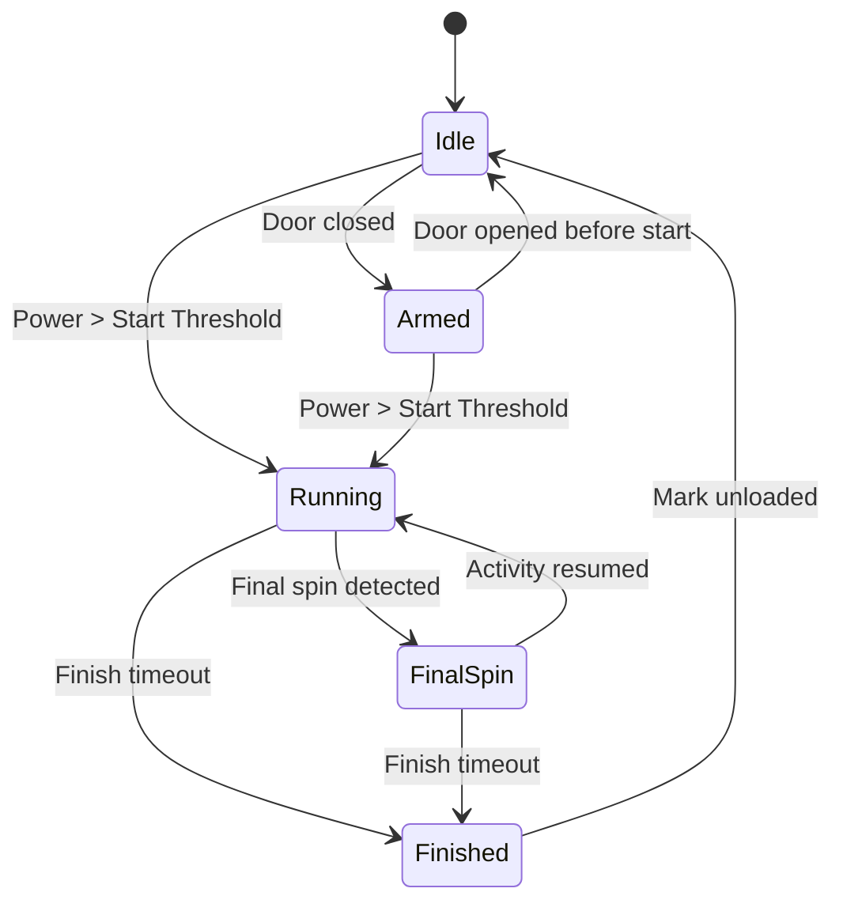

# Laundry Monitor Specification

Status: Draft  
Version: 0.1  
Language: English  
Project: HA-Laundry-Monitor

## 1. Purpose

Laundry Monitor is a Home Assistant custom integration for monitoring washing machine cycles using external sensors.

The integration does not communicate with the washing machine directly. Instead, it analyzes signals from sensors such as:

- power meter / smart plug;
- door sensor;
- vibration sensor;
- optional leak sensor;
- optional energy sensor for diagnostics.

Laundry Monitor is designed to answer:

- Is the washing machine idle?
- Has a cycle started?
- Is the machine currently running?
- Was final spin detected?
- Has the cycle finished?
- Has the laundry been removed?
- Why did the integration decide that?

## 2. Project Scope

### 2.1 In scope

Laundry Monitor shall support:

- washing machines;
- power-based activity detection;
- door-based laundry removal detection;
- vibration-based spin detection;
- optional leak detection;
- diagnostic entities;
- Home Assistant events;
- debug mode;
- localization;
- multiple configured washing machines.

### 2.2 Out of scope

Laundry Monitor shall not provide:

- vendor-specific washing machine integration;
- direct control of washing machines;
- automatic plug shutdown;
- notifications;
- siren control;
- dishwasher support;
- dryer support;
- robot vacuum support.

These actions can be implemented by the user through standard Home Assistant automations.

## 3. Design Principles

### 3.1 Passive integration

Laundry Monitor must not control devices.

It may expose sensors, binary sensors, events, diagnostics, and statistics, but it must not:

- turn off smart plugs;
- send notifications;
- trigger alarms;
- start or stop washing machines;
- modify external entities.

### 3.2 Observability

Every major internal decision should be observable.

The user should be able to understand:

- current state;
- last transition;
- transition reason;
- confidence;
- last activity time;
- last vibration time;
- last power activity time.

### 3.3 Explainability

Laundry Monitor should explain its conclusions.

Example:

```text
State: Finished
Reason: No activity for 10 minutes after final spin
Confidence: 96%
```
The confidence value is intended as a diagnostic indicator only. Confidence calculation is implementation-specific and may change between releases without affecting the public API.

Evidence:
- final spin detected
- power below activity threshold
- no vibration
- door still closed


### 3.4 Modular algorithms

Cycle detection should be split into replaceable components:

- activity detector;
- spin detector;
- finish detector;
- leak detector;
- state machine;
- laundry tracking.

This allows future algorithm changes without breaking public entities or events.

### 3.5 Stable public API

Public entity states and event names must remain stable.

Localized strings may change, but internal state identifiers must not.

### 3.6 Use native Home Assistant entity types whenever possible.

Laundry Monitor should prefer standard Home Assistant entities (such as button, sensor, binary_sensor, number, and select) over custom services or proprietary APIs. Custom services should only be introduced when no suitable native entity exists.

## 4. Data Sources
### 4.1 Required sources

The following sources are required:

- power sensor;
- door sensor;
- vibration sensor.

Power sensor is required for detection of running state
Door sensor is required for detection of laundry removal.
Vibration sensor is required for detection of final spin.

Example:

```text
sensor.washing_machine_power
sensor.washing_machine_door
sensor.washing_machine_vibration
```

### 4.2 Optional sources

Optional sensors:

- leak sensor;
- energy sensor;
- plug switch state.

Optional sensors may improve diagnostics and statistics but must not be required for basic operation.

## 5. State Model
### 5.1 Public states

The integration should expose a user-facing state sensor.

| State | Description |
|---|---|
| `idle` | Machine is idle and ready for a new cycle. |
| `armed` | Door has been closed and the integration is waiting for the cycle to start. |
| `running` | Washing cycle is active. |
| `final_spin` | Final spin has likely been detected. |
| `finished` | Washing cycle has finished. Laundry may still be inside the machine. |
| `error` | Abnormal condition detected. |

The `finished` state remains active until the laundry is explicitly marked as removed by the user (if Laundry Tracking is enabled) or until a new cycle starts.

### 5.2 Internal states

The implementation may use additional internal states that are not exposed to the user.

| Internal state | Public state |
|---|---|
| `IDLE` | `idle` |
| `ARMED` | `armed` |
| `RUNNING` | `running` |
| `LOW_POWER_CONFIRMATION` | `running` |
| `SPIN_CANDIDATE` | `running` |
| `FINAL_SPIN_CONFIRMED` | `final_spin` |
| `FINISH_CONFIRMATION` | `final_spin` |
| `FINISHED` | `finished` |
| `ERROR` | `error` |

Internal states may evolve between releases without affecting the public API.


## 6. State Transitions
### 6.1 Basic transition model


## 6.2 Transition table

| Current state | Event | Next state | Notes |
|---|---|---|---|
| `idle` | Door closed | `armed` | Optional when door sensor exists |
| `idle` | Power above start threshold | `running` | fallback when door evidence is unavailable |
| `armed` | Power above start threshold | `running` | Cycle started |
| `armed` | Door opened | `idle` | Start cancelled |
| `running` | Final spin detected | `final_spin` | Based on vibration pattern |
| `running` | No activity timeout | `finished` | Fallback if spin is not detected |
| `final_spin` | Activity detected | `running` | False final spin candidate |
| `final_spin` | No activity timeout | `finished` | Cycle finished |
| `finished` | Door opened | `finished` | Door opening is diagnostic only; it must not imply laundry removal |
| `finished` | Mark unloaded | `idle` | Explicit user action via button or service |
| Any | Leak detected | Same cycle state + leak alert | Leak engine is separate |

### 6.3 Laundry Tracking

Laundry Tracking is an optional module independent of the cycle state machine.

The cycle state machine determines the current state of the washing machine cycle.

Laundry Tracking determines whether laundry is believed to still be inside the machine.

Laundry Monitor must not assume that opening the door means the laundry has been removed. Laundry removal is an explicit user action.

If Laundry Tracking is enabled, the integration shall expose:

- `button.<device>_mark_unloaded`
- `binary_sensor.<device>_laundry_present`
- `sensor.<device>_last_unloaded_at`

The module shall behave as follows:

| Event | Laundry Present |
|---|---|
| Cycle started | `on` |
| Cycle finished | `on` |
| Door opened after finish | unchanged |
| User presses **Mark Unloaded** | `off` |

Opening the door after the cycle has finished may fire the `laundry_monitor.door_opened_after_finish` event for diagnostic or automation purposes, but it must not change the laundry tracking state.

Laundry is marked as removed only when the user presses `button.<device>_mark_unloaded` or invokes the corresponding service.

## 7. Detection Logic
### 7.1 Activity detection

Activity is detected primarily from power.

Example defaults:

|Parameter	|Default|
|--- | --- |
|Start threshold	|10 W|
|Activity threshold	|5 W|
|Start confirmation	|30 s|
|Finish timeout	|10 min|

These values must be configurable.

## 7.2 Final spin detection

Final spin detection should use vibration data when available.

A possible first implementation:

- machine is already running;
- vibration events occur frequently;
- vibration lasts longer than configured minimum duration;
- power activity exists during or near the vibration window.

Example defaults:

|Parameter	|Default|
|--- | --- |
|Minimum spin duration	|120 s|
|Spin cooldown	|300 s|
|Required confidence	|70%|

## 7.3 Finish detection

Finish detection should not rely on standby power level.

The integration should avoid trying to distinguish:

- plug idle consumption;
- washing machine standby;
- low-power pauses during cycle.

Instead, finish should be inferred from absence of meaningful activity over time.

## 8. Leak Model

Leak detection belongs to a separate leak layer.

Laundry Monitor may expose:

- binary_sensor.<device>_leak_alarm;
- sensor.<device>_leak_state;
- laundry_monitor.leak_detected event.

Laundry Monitor must not turn off the plug automatically.

Users may create their own automations based on the leak event.

## 9. Home Assistant Entities
### 9.1 Main sensors

|Entity	|Example state|
|--- | --- |
|sensor.<device>_state	|running|
|sensor.<device>_last_transition_reason	|Power above start threshold|
|sensor.<device>_confidence	|94|
|sensor.<device>_current_power	|38.2 W|
|sensor.<device>_current_cycle_duration	|01:24:12|
|sensor.<device>_last_activity	|timestamp|
|sensor.<device>_last_cycle_duration	|02:11:34|
|sensor.<device>_last_cycle_energy	|0.82 kWh|

### 9.2 Binary sensors
|Entity	|Meaning|
|--- | --- |
|binary_sensor.<device>_running	|Current cycle is running|
|binary_sensor.<device>_finished	|Cycle finished|
|binary_sensor.<device>_final_spin_detected	|Final spin was detected|
|binary_sensor.<device>_activity_detected	|Current activity detected|
|binary_sensor.<device>_leak_alarm	|Leak sensor active|

### 9.3 Diagnostic entities

Diagnostic entities may include:

- power threshold;
- activity threshold;
- finish timeout;
- spin detection status;
- last vibration event;
- last power activity;
- current evidence list;
- raw sensor availability.

## 10. Events

Laundry Monitor should fire Home Assistant events.

### 10.1 Event names
- laundry_monitor.cycle_started
- laundry_monitor.final_spin_detected
- laundry_monitor.cycle_finished
- laundry_monitor.machine_unloaded
- laundry_monitor.leak_detected
- laundry_monitor.state_changed

### 10.2 Event payload

```text
Example:

{
  "device_id": "washer",
  "entry_id": "abc123",
  "old_state": "running",
  "new_state": "finished",
  "reason": "No activity for 10 minutes after final spin",
  "confidence": 96,
  "timestamp": "2026-07-09T14:30:00+03:00"
}
```

## 11. Configuration
### 11.1 Config Flow

The integration shall be configured through Home Assistant UI.

Required fields:

- power sensor.
- door sensor;
- vibration sensor.

Optional fields:

- leak sensor;
- energy sensor;
- plug switch.

### 11.2 Options Flow

User-configurable options:

- start threshold;
- activity threshold;
- finish timeout;
- spin detection enabled;
- spin minimum duration;
- debug mode;
- experimental sensors enabled.

## 12. Localization

Laundry Monitor must support localization from the first version.

### 12.1 Requirements
- All user-visible strings must be localizable.
- English is the default language.
- Additional languages may be added by contributors.
- Internal state identifiers must not be localized.
- Entity states used for automations must remain stable.
- UI labels, descriptions, config flow text, options text, and diagnostics must use Home Assistant translation files.

### 12.2 Suggested structure
```text
custom_components/laundry_monitor/
  strings.json
  translations/
    en.json
    ru.json
```

Documentation may be organized as:

```text
docs/
  en/
    SPECIFICATION.md
    ARCHITECTURE.md
    STATE_MACHINE.md
  ru/
    SPECIFICATION.md
    ARCHITECTURE.md
    STATE_MACHINE.md
```

The English documentation is canonical.

Translated documentation should follow the English version and must not define separate behavior.

## 13. Debug Mode

Debug Mode is a first-class feature.

It should expose:

- current state;
- confidence;
- transition reason;
- evidence;
- raw power;
- raw vibration;
- raw door state;
- last activity time;
- last state transition;
- algorithm parameters.

Future versions may include cycle playback.

## 14. Non-goals

Laundry Monitor is not:

- a notification system;
- a washing machine controller;
- a vendor integration;
- a dishwasher monitor;
- a universal appliance monitor;
- a replacement for Home Assistant automations.

## 15. Roadmap
### v0.1
- project skeleton;
- config flow;
- basic power-based state machine;
- diagnostic entities;
- localization foundation.

### v0.2
- door sensor support;
- Laundry Tracking module;
- Home Assistant events.

### v0.3
- vibration-based final spin detection;
- confidence calculation;
- debug diagnostics.

### v0.4
- leak sensor support;
- leak state;
- event payload improvements.

### v1.0
- stable public API;
- documented state machine;
- HACS-ready release;
- English documentation;
- localization support.

## 16. Open Questions
- Should confidence be a percentage or diagnostic enum?
- Should final spin detection be enabled by default?
