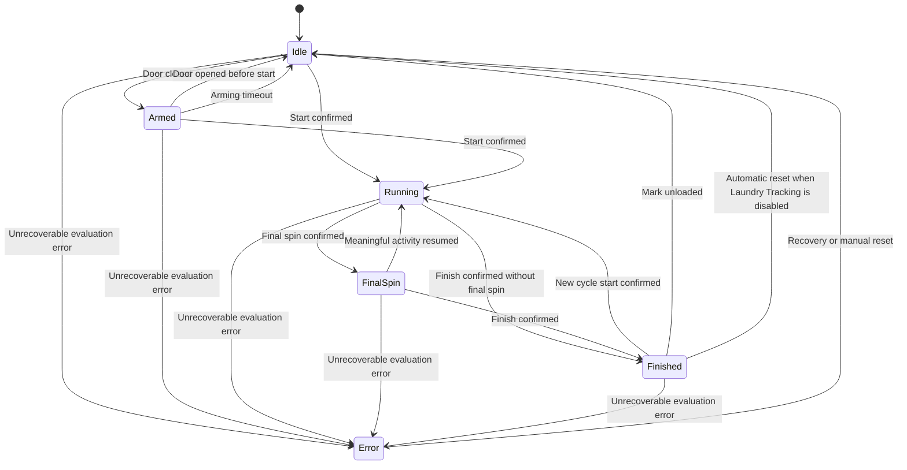

# Laundry Monitor State Machine

Status: Draft
Version: 0.1
Language: English
Project: HA-Laundry-Monitor

## 1. Purpose

This document defines the cycle state machine used by Laundry Monitor.

The state machine represents the integration's current understanding of the washing machine cycle. It consumes normalized detector results and produces:

* the public cycle state;
* state transition records;
* transition reasons;
* diagnostic evidence;
* Home Assistant events.

The state machine does not directly analyze raw sensor values. Raw power, door, vibration, and other sensor data must first be processed by the corresponding detectors.

The following modules are outside the cycle state machine:

* Laundry Tracking;
* Leak Detector;
* notification logic;
* external device control;
* user automations.

## 2. Design Goals

The state machine shall:

* provide a small and stable public state model;
* tolerate low-power pauses during a washing cycle;
* operate without a door sensor;
* operate without a vibration sensor;
* avoid relying on exact standby power values;
* explain every public state transition;
* recover safely after Home Assistant restarts;
* avoid assuming that opening the door means laundry was removed;
* remain independent from leak detection and laundry tracking.

## 3. Public States

The public cycle state is exposed through:

```text
sensor.<device>_state
```

The state value must use stable, non-localized identifiers.

| State        | Description                                                                                                          |
| ------------ | -------------------------------------------------------------------------------------------------------------------- |
| `idle`       | No active or completed cycle is currently being tracked. The integration is ready to detect a new cycle.             |
| `armed`      | The door has been closed and the integration is waiting for meaningful activity indicating that a cycle has started. |
| `running`    | A washing cycle is believed to be active.                                                                            |
| `final_spin` | A probable final spin has been detected and the integration is waiting for cycle completion or renewed activity.     |
| `finished`   | The cycle is believed to have finished. Laundry may still be inside the machine.                                     |
| `error`      | The integration cannot reliably continue normal cycle evaluation because of an abnormal internal or input condition. |

Public states form part of the integration's public API.

New public states should not be introduced without a clear use case and a compatibility review.

## 4. Internal States

The implementation may use more detailed internal states.

Possible internal states include:

| Internal state              | Public state              | Purpose                                                                         |
| --------------------------- | ------------------------- | ------------------------------------------------------------------------------- |
| `IDLE`                      | `idle`                    | Waiting for a new cycle.                                                        |
| `ARMED`                     | `armed`                   | Door closure observed; waiting for start confirmation.                          |
| `START_CONFIRMATION`        | `armed`                   | Start threshold exceeded, but confirmation duration has not elapsed.            |
| `RUNNING`                   | `running`                 | Active cycle confirmed.                                                         |
| `LOW_ACTIVITY_CONFIRMATION` | `running`                 | Meaningful activity has temporarily stopped; finish timeout is being evaluated. |
| `SPIN_CANDIDATE`            | `running`                 | Vibration pattern may represent final spin but is not yet confirmed.            |
| `FINAL_SPIN_CONFIRMED`      | `final_spin`              | Probable final spin confirmed.                                                  |
| `FINISH_CONFIRMATION`       | `final_spin` or `running` | Waiting for the configured period without meaningful activity.                  |
| `FINISHED`                  | `finished`                | Cycle completion confirmed.                                                     |
| `ERROR`                     | `error`                   | State evaluation cannot safely continue.                                        |

Internal states are implementation details and may change between compatible releases.

## 5. State Machine Inputs

The state machine receives normalized observations from other components.

### 5.1 Activity Detector inputs

The Activity Detector may provide:

* `activity_detected`;
* `start_candidate`;
* `start_confirmed`;
* `last_activity_at`;
* activity evidence;
* activity confidence.

The Activity Detector answers:

> Was there meaningful activity since the previous evaluation?

It does not directly change the public cycle state.

### 5.2 Spin Detector inputs

The Spin Detector may provide:

* `spin_candidate`;
* `final_spin_detected`;
* `spin_started_at`;
* `spin_ended_at`;
* spin evidence;
* spin confidence.

A detected spin is not automatically assumed to be the final spin. Confirmation logic may use duration, event frequency, power activity, cycle age, and other available evidence.

### 5.3 Finish Detector inputs

The Finish Detector may provide:

* `finish_candidate`;
* `finish_confirmed`;
* `inactive_duration`;
* finish evidence;
* finish confidence.

Finish detection should primarily depend on the absence of meaningful activity for a configurable duration.

It must not depend on distinguishing small differences between:

* smart plug self-consumption;
* washing machine standby consumption;
* low-power pauses during a cycle.

### 5.4 Door observations

When configured, the door sensor may provide:

* `door_opened`;
* `door_closed`;
* `door_available`;
* `last_door_change_at`.

The door sensor may assist with arming and diagnostics.

Opening the door after cycle completion must not imply that laundry was removed.

### 5.5 System observations

The state machine may also receive:

* Home Assistant start or stop;
* source entity availability changes;
* configuration changes;
* restored state;
* manual reset requests, if such a feature is introduced.

## 6. Basic Transition Model



The transition from `finished` to `idle` depends on the Laundry Tracking configuration and is described in Section 10.

## 7. Transition Table

| Current state    | Event or condition             | Next state       | Required behavior                                                                                |
| ---------------- | ------------------------------ | ---------------- | ------------------------------------------------------------------------------------------------ |
| `idle`           | Door closed                    | `armed`          | Applicable only when a door sensor is configured and arming by door is enabled.                  |
| `idle`           | Start confirmed                | `running`        | Supports operation without a door sensor and cycles started without an observed door transition. |
| `armed`          | Start confirmed                | `running`        | Record cycle start time and emit the cycle-start event.                                          |
| `armed`          | Door opened before start       | `idle`           | Cancel the pending start.                                                                        |
| `armed`          | Arming timeout                 | `idle`           | Prevent the integration from remaining armed indefinitely.                                       |
| `running`        | Final spin confirmed           | `final_spin`     | Record spin evidence and emit the final-spin event.                                              |
| `running`        | Finish confirmed               | `finished`       | Fallback path when final spin is unavailable or not detected.                                    |
| `final_spin`     | Meaningful activity resumed    | `running`        | The detected spin was not terminal, or the cycle continued after it.                             |
| `final_spin`     | Finish confirmed               | `finished`       | Confirm normal cycle completion.                                                                 |
| `finished`       | Door opened                    | `finished`       | Diagnostic event only. Laundry removal must not be inferred.                                     |
| `finished`       | Mark unloaded                  | `idle`           | Available when Laundry Tracking is enabled. Laundry Tracking is updated separately.              |
| `finished`       | Automatic reset condition      | `idle`           | Used only when Laundry Tracking is disabled.                                                     |
| `finished`       | New cycle start confirmed      | `running`        | Start a new cycle even if the previous cycle was not explicitly reset.                           |
| Any normal state | Unrecoverable evaluation error | `error`          | Record the reason and affected inputs.                                                           |
| `error`          | Recovery completed             | `idle`           | Resume from a conservative known state.                                                          |
| Any state        | Leak detected                  | Same cycle state | Leak detection is outside the cycle state machine.                                               |

## 8. State Definitions

### 8.1 `idle`

#### Meaning

The integration is not currently tracking an active or completed cycle.

#### Entry actions

On entry, the state machine should:

* clear transient cycle detection candidates;
* clear temporary spin and finish confirmation windows;
* preserve completed-cycle statistics;
* record the transition reason;
* expose `binary_sensor.<device>_running` as `off`;
* expose `binary_sensor.<device>_finished` as `off`.

Laundry presence is managed by Laundry Tracking and must not be cleared merely because the cycle state enters `idle`, except when the explicit unload operation requires both modules to be updated.

#### Valid exits

* `idle → armed`
* `idle → running`
* `idle → error`

### 8.2 `armed`

#### Meaning

The door has been closed and a possible new cycle is expected, but meaningful activity has not yet been confirmed.

The `armed` state is optional. Installations without a door sensor can transition directly from `idle` to `running`.

#### Entry actions

On entry, the state machine should:

* record the arming timestamp;
* begin the optional arming timeout;
* retain no assumption that a cycle has started.

#### Cancellation

Arming should be cancelled when:

* the door opens before cycle start;
* the arming timeout expires;
* relevant configuration changes invalidate the pending start.

#### Valid exits

* `armed → running`
* `armed → idle`
* `armed → error`

### 8.3 `running`

#### Meaning

A washing cycle has been confirmed.

Short periods of low or near-zero power do not cause an immediate state transition. Such periods are expected during normal washing programs.

#### Entry actions for a new cycle

When entering `running` because a new cycle has started, the state machine should:

* assign a new cycle identifier;
* record `cycle_started_at`;
* clear data from incomplete start candidates;
* initialize cycle duration and energy tracking;
* notify Laundry Tracking that a cycle has started;
* emit `laundry_monitor.cycle_started`;
* record the transition reason and supporting evidence.

#### Re-entry from `final_spin`

When returning from `final_spin` because activity resumed, the existing cycle must continue. A new cycle identifier must not be created.

#### Valid exits

* `running → final_spin`
* `running → finished`
* `running → error`

### 8.4 `final_spin`

#### Meaning

The Spin Detector has identified a vibration and activity pattern that probably represents the final spin stage.

This state expresses a probable cycle phase, not guaranteed cycle completion.

#### Entry actions

On entry, the state machine should:

* record the final-spin detection timestamp;
* preserve the detector evidence;
* emit `laundry_monitor.final_spin_detected`;
* start or continue finish evaluation.

#### Activity after final spin

If meaningful activity resumes, the state machine must return to `running`.

This does not necessarily mean that the spin detection was incorrect. Some washing machines perform additional pumping, balancing, drum movement, or another spin after an apparent final spin.

The transition reason should therefore avoid asserting an algorithm failure unless the evidence clearly supports that conclusion.

Recommended reason:

```text
Meaningful activity resumed after final spin detection
```

#### Valid exits

* `final_spin → running`
* `final_spin → finished`
* `final_spin → error`

### 8.5 `finished`

#### Meaning

The Finish Detector has confirmed that the washing cycle is complete.

The state means that the cycle has ended. It does not mean that the laundry has been removed.

#### Entry actions

On entry, the state machine should:

* record `cycle_finished_at`;
* finalize cycle duration;
* finalize cycle energy when an energy source is available;
* preserve completion evidence;
* notify Laundry Tracking that the cycle has finished;
* emit `laundry_monitor.cycle_finished`;
* expose `binary_sensor.<device>_finished` as `on`.

#### Door opening

Opening the door while in `finished`:

* must not change the cycle state;
* must not mark laundry as removed;
* may emit `laundry_monitor.door_opened_after_finish`;
* may update diagnostic timestamps.

#### Valid exits

* `finished → idle`
* `finished → running`
* `finished → error`

### 8.6 `error`

#### Meaning

The integration cannot continue normal state evaluation with sufficient reliability.

The `error` state should be used conservatively. Temporary loss of an optional sensor should not cause an error.

#### Possible causes

Examples include:

* required power sensor unavailable beyond a configured tolerance;
* invalid or non-numeric required power data;
* corrupted restored state;
* an internal state machine invariant violation;
* an unrecoverable detector exception.

#### Entry actions

On entry, the state machine should:

* preserve the previous state;
* record the error reason;
* record affected entities or components;
* avoid fabricating cycle completion;
* avoid modifying Laundry Tracking;
* expose diagnostic information.

#### Recovery

When the required input becomes valid again, the implementation may:

* restore the previous state when this is safe and sufficiently supported;
* reconstruct the likely state from restored cycle context;
* return to `idle` as a conservative fallback.

Recovery behavior must be recorded as a state transition with an explicit reason.

## 9. Start Detection

### 9.1 Start candidate

A single power reading above the start threshold should normally create a start candidate rather than immediately starting a cycle.

The candidate becomes confirmed after the configured start confirmation duration or another implementation-specific confirmation rule.

### 9.2 Start from `idle`

A confirmed start must transition directly to `running`, even when:

* no door sensor is configured;
* no preceding `armed` state was observed;
* the door was already closed before Home Assistant started;
* the integration missed the door-closing event.

### 9.3 Start from `finished`

A new confirmed start while the state is `finished` must start a new cycle.

The integration must not fail to detect a new cycle merely because the previous load was not marked as unloaded.

When Laundry Tracking is enabled, the implementation should preserve that laundry is present and begin tracking the new cycle. It may also record a diagnostic condition indicating that a new cycle started before the previous load was explicitly marked as unloaded.

### 9.4 False start

If a start candidate disappears before confirmation:

* the public state should remain unchanged;
* no cycle-start event should be emitted;
* the candidate and reason should remain available in diagnostics when debug mode is enabled.

## 10. Interaction with Laundry Tracking

Laundry Tracking is independent from cycle detection.

The cycle state machine may notify Laundry Tracking about cycle lifecycle events, but Laundry Tracking must not influence activity, spin, finish, or cycle-state decisions.

### 10.1 Laundry Tracking enabled

When Laundry Tracking is enabled:

1. A confirmed cycle start sets `laundry_present` to `on`.
2. Entering `finished` leaves `laundry_present` as `on`.
3. Opening the door does not change `laundry_present`.
4. Pressing `button.<device>_mark_unloaded` sets `laundry_present` to `off`.
5. The explicit unload action transitions the cycle state from `finished` to `idle`.
6. The unload timestamp is recorded.
7. The integration emits `laundry_monitor.machine_unloaded`.

The Mark Unloaded button should normally be available only when marking laundry as unloaded is meaningful.

The implementation may expose it outside `finished`, but such behavior must be clearly defined. A press outside a valid context should either:

* perform no state change and record a diagnostic reason; or
* mark laundry as absent without modifying the cycle state.

The selected behavior must be consistent and tested.

### 10.2 Laundry Tracking disabled

When Laundry Tracking is disabled, explicit unload confirmation is not required.

The implementation must provide a deterministic transition from `finished` back to `idle`. This may be based on:

* a configurable completed-state retention period;
* the next confirmed cycle start;
* an explicit reset button, if introduced.

The default behavior should preserve `finished` long enough for Home Assistant automations and users to observe cycle completion.

The exact default retention duration is configurable and is not defined by this document.

### 10.3 Door sensor independence

Door state must not be used as proof of laundry presence or removal.

The door sensor may only provide:

* optional arming;
* start-context information;
* diagnostic events;
* evidence that the machine was accessed after completion.

## 11. Interaction with the Leak Detector

The Leak Detector is independent from the cycle state machine.

A leak may occur while the cycle state is:

* `idle`;
* `armed`;
* `running`;
* `final_spin`;
* `finished`;
* `error`.

Leak detection must not automatically change the cycle state.

For example, the following combination is valid:

```text
Cycle state: running
Leak state: leak_detected
```

The integration may:

* expose a leak binary sensor;
* expose a leak-state sensor;
* emit `laundry_monitor.leak_detected`;
* include the leak condition in diagnostics.

The integration must not automatically:

* turn off the smart plug;
* stop the washing machine;
* send a notification;
* change the cycle to `finished` or `error` solely because a leak was detected.

Those actions belong to user-configured Home Assistant automations.

## 12. Sensor Availability

### 12.1 Required power sensor unavailable

The power sensor is required for basic cycle detection.

A brief interruption should not immediately cause an incorrect transition.

While the required power sensor is temporarily unavailable:

* existing finish timers should not continue as if zero power had been observed;
* absence of data must not be interpreted as inactivity;
* the current public state should normally be preserved;
* the unavailable duration should be recorded.

If unavailability exceeds the configured tolerance, the implementation may enter `error`.

### 12.2 Door sensor unavailable

Loss of the door sensor must not stop cycle detection.

The state machine should:

* stop relying on door-based arming;
* permit direct `idle → running` transitions;
* preserve the current cycle state;
* expose the sensor problem in diagnostics.

### 12.3 Vibration sensor unavailable

Loss of the vibration sensor must not stop cycle detection.

The state machine should:

* disable or suspend final-spin detection;
* continue using power-based activity and finish detection;
* permit `running → finished`;
* expose the degraded mode in diagnostics.

### 12.4 Leak sensor unavailable

Loss of the leak sensor must not affect the cycle state.

Only leak-related diagnostics and leak reporting are affected.

### 12.5 Energy sensor unavailable

Loss of an optional energy sensor must not affect state transitions.

## 13. Home Assistant Restart and State Restoration

### 13.1 General rule

A Home Assistant restart must not by itself create false events such as:

* cycle started;
* final spin detected;
* cycle finished;
* laundry unloaded.

Restoration must distinguish between:

* restoring an existing known state;
* detecting a new transition after startup.

### 13.2 Restoring `idle`

The integration may safely restore `idle` when no active cycle context exists.

### 13.3 Restoring `armed`

The integration may restore `armed` only when:

* the previous state was persisted;
* the arming period has not expired;
* the configured door sensor remains closed or no contradictory evidence exists.

Otherwise, it should return to `idle`.

### 13.4 Restoring `running`

When restoring `running`, the integration should preserve:

* cycle identifier;
* cycle start timestamp;
* last meaningful activity timestamp;
* accumulated cycle energy, when available;
* detector context required for safe continuation.

The integration must not immediately declare the cycle finished solely because the first power reading after restart is low.

### 13.5 Restoring `final_spin`

The integration may restore `final_spin` when sufficient detector and timing context is available.

Otherwise, it should conservatively restore `running` and continue finish evaluation.

### 13.6 Restoring `finished`

The `finished` state should be restored so that completion status survives a Home Assistant restart.

When Laundry Tracking is enabled, laundry presence and the last unload timestamp must be restored independently.

### 13.7 Restoring `error`

The integration should re-evaluate the error condition after startup.

It may remain in `error` or recover according to Section 8.6.

## 14. Timing Rules

### 14.1 Monotonic evaluation

Durations used by detectors should be evaluated with a monotonic time source where practical.

Wall-clock timestamps may be stored for display and persistence.

### 14.2 Timer interruption

Configuration reloads, entity unavailability, and Home Assistant restarts must not silently convert interrupted timers into confirmed transitions.

### 14.3 Finish timeout

The finish timeout starts from the last meaningful activity, not merely from the latest low-power reading.

Any new meaningful activity must reset or cancel the pending finish confirmation.

### 14.4 Arming timeout

The `armed` state should have a configurable timeout to avoid remaining active indefinitely after an ordinary door closure.

### 14.5 Completed-state retention

When Laundry Tracking is disabled, the duration for which `finished` remains visible should be configurable.

## 15. Transition Records

Every public state transition should produce an internal transition record containing at least:

| Field        | Description                                        |
| ------------ | -------------------------------------------------- |
| `timestamp`  | Time of the transition.                            |
| `old_state`  | Previous public state.                             |
| `new_state`  | New public state.                                  |
| `reason`     | Stable or localizable explanation key.             |
| `confidence` | Diagnostic confidence, when available.             |
| `evidence`   | Detector evidence supporting the transition.       |
| `cycle_id`   | Identifier of the affected cycle, when applicable. |

Confidence calculation is implementation-specific and may change without affecting the public state model.

A transition reason should describe what caused the transition, not merely repeat the destination state.

Preferred:

```text
No meaningful activity for 10 minutes after final spin
```

Avoid:

```text
Cycle finished
```

## 16. Home Assistant Events

The state machine may emit the following events:

| Transition or observation  | Event                                      |
| -------------------------- | ------------------------------------------ |
| New cycle confirmed        | `laundry_monitor.cycle_started`            |
| Final spin confirmed       | `laundry_monitor.final_spin_detected`      |
| Cycle completion confirmed | `laundry_monitor.cycle_finished`           |
| Door opened while finished | `laundry_monitor.door_opened_after_finish` |
| Explicit unload confirmed  | `laundry_monitor.machine_unloaded`         |
| Any public state change    | `laundry_monitor.state_changed`            |

State restoration after restart must not emit lifecycle events unless a genuinely new transition is detected.

## 17. State Invariants

The implementation must preserve the following invariants:

1. Only the state machine may change the public cycle state.
2. Laundry Tracking must not determine the cycle state.
3. Leak detection must not determine the cycle state.
4. Door opening must not imply laundry removal.
5. Missing optional sensors must not stop basic cycle detection.
6. Missing sensor data must not be interpreted as zero power or inactivity.
7. A cycle-start event must be emitted no more than once per cycle.
8. A cycle-finished event must be emitted no more than once per cycle.
9. Returning from `final_spin` to `running` must not create a new cycle.
10. Restoring state after restart must not create duplicate lifecycle events.
11. The `finished` state must not assert that laundry has been removed.
12. Public state values must not be localized.

## 18. Edge Cases

### 18.1 Long low-power pause during a cycle

Expected behavior:

* remain in `running`;
* begin finish evaluation;
* cancel finish evaluation when meaningful activity resumes;
* do not emit a completion event unless the full finish rule is satisfied.

### 18.2 Final spin is not detected

Expected behavior:

* remain in `running`;
* allow direct transition to `finished` when the Finish Detector confirms completion;
* report that final-spin evidence was unavailable or absent.

### 18.3 Multiple spin periods

Expected behavior:

* the first qualifying spin may produce a candidate;
* renewed activity returns the state to `running`;
* a later spin may again be evaluated as final spin;
* only confirmed detector output changes the public state.

### 18.4 Door is opened during a running cycle

Expected behavior:

* preserve `running` unless other detector evidence establishes that the cycle stopped;
* record the door event diagnostically;
* do not mark laundry as removed.

### 18.5 Door is opened after finish

Expected behavior:

* preserve `finished`;
* optionally emit `laundry_monitor.door_opened_after_finish`;
* do not modify Laundry Tracking.

### 18.6 User forgets to mark laundry as unloaded

Expected behavior when Laundry Tracking is enabled:

* `laundry_present` remains `on`;
* `finished` remains observable until reset by the defined behavior;
* a new cycle may still be detected;
* no cycle detection functionality is blocked.

### 18.7 New cycle begins while state is `finished`

Expected behavior:

* create a new cycle;
* transition to `running`;
* emit one new cycle-start event;
* retain diagnostics showing that the previous completed load was not explicitly marked as unloaded, when Laundry Tracking is enabled.

### 18.8 Smart plug is switched off

If the plug switch entity is available, switching it off may be recorded as diagnostic evidence.

The state machine must not immediately interpret loss of power telemetry as normal cycle completion.

### 18.9 Home Assistant starts during an active cycle

Expected behavior:

* restore an active cycle when sufficient persisted context exists;
* otherwise wait for meaningful evidence before selecting a state;
* do not generate a false cycle-start event solely because current power is already above the threshold.

### 18.10 Configuration threshold changes during a cycle

Threshold changes should apply without corrupting the current cycle.

The implementation should:

* preserve the current state;
* clear incompatible unconfirmed candidates;
* record the configuration change;
* avoid retroactively generating transitions.

## 19. Invalid Transitions

The following transitions are not normally permitted:

| Invalid transition                                      | Reason                                                  |
| ------------------------------------------------------- | ------------------------------------------------------- |
| `idle → final_spin`                                     | Final spin requires an active tracked cycle.            |
| `idle → finished`                                       | Completion requires a tracked or safely restored cycle. |
| `armed → final_spin`                                    | A cycle must first be confirmed as running.             |
| `armed → finished`                                      | A pending start cannot finish.                          |
| `finished → final_spin`                                 | Final spin belongs to an active cycle.                  |
| `error → finished`                                      | Recovery must not fabricate completion.                 |
| Any state → `idle` because the door opened after finish | Door opening does not confirm unload.                   |

If an implementation encounters an invalid transition request, it should:

* reject the transition;
* preserve the current state;
* record a diagnostic error;
* enter `error` only if the condition indicates an internal invariant violation.

## 20. Reference Transition Scenarios

### 20.1 Cycle with door and vibration sensors

```text
idle
→ armed
  Reason: Door closed

armed
→ running
  Reason: Power remained above start threshold for start confirmation period

running
→ final_spin
  Reason: Final spin pattern confirmed by vibration and power activity

final_spin
→ finished
  Reason: No meaningful activity for finish timeout

finished
→ idle
  Reason: User pressed Mark Unloaded
```

### 20.2 Cycle without door or vibration sensors

```text
idle
→ running
  Reason: Power remained above start threshold for start confirmation period

running
→ finished
  Reason: No meaningful activity for finish timeout

finished
→ idle
  Reason: Completed-state retention period expired
```

### 20.3 False final-spin candidate

```text
running
→ final_spin
  Reason: Probable final spin confirmed

final_spin
→ running
  Reason: Meaningful activity resumed

running
→ finished
  Reason: No meaningful activity for finish timeout
```

### 20.4 Required power sensor becomes unavailable

```text
running
→ running
  Reason: Power sensor temporarily unavailable; state preserved

running
→ error
  Reason: Required power sensor unavailable beyond tolerance

error
→ idle
  Reason: Power sensor recovered; active cycle could not be safely reconstructed
```

## 21. Testing Requirements

The state machine should be testable independently from Home Assistant entities.

At minimum, automated tests should cover:

* every valid public transition;
* every invalid public transition;
* direct start without a door sensor;
* arming and arming cancellation;
* start confirmation;
* false start rejection;
* long low-power pauses;
* finish detection without final spin;
* final spin followed by renewed activity;
* final spin followed by completion;
* door opening during `running`;
* door opening during `finished`;
* explicit unload behavior;
* Laundry Tracking disabled behavior;
* new cycle beginning from `finished`;
* optional sensor unavailability;
* required power sensor unavailability;
* Home Assistant restart in every public state;
* duplicate event prevention;
* leak detection without cycle-state changes;
* configuration changes during an active cycle.

Tests should use deterministic timestamps and detector outputs.

## 22. Open Decisions

The following details remain implementation or configuration decisions:

* default arming timeout;
* default completed-state retention when Laundry Tracking is disabled;
* exact start confirmation algorithm;
* exact final-spin detection algorithm;
* exact finish confidence calculation;
* whether Mark Unloaded is accepted outside `finished`;
* whether recovery from `error` may restore the previous active state;
* whether `error` should be exposed as a public cycle state or through a separate diagnostic entity in the stable release.

These decisions must not violate the invariants defined in this document.
